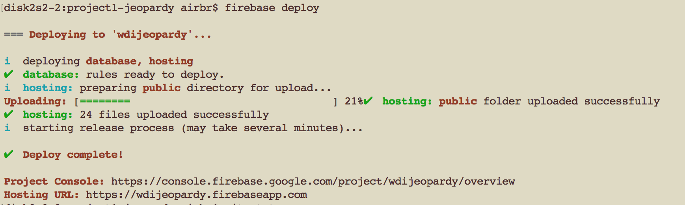

# Firebase Deployment
#### Re Project 1 from [WDI Project Requirements](https://github.com/ATL-WDI-Curriculum/projects/blob/master/project1.md) 

Firebase is a deployment option that is also available to you to deploy your first WDI Project incorporating HTML, CSS, JavaScript and DOM manipulation among the other requirements of the project in the specification.

Deployment should be a late stage concern of yours but not a last minute concern. Firebase is one option you may decide to use to access the various benefits of the Firebase platform and is a good example of efficient command line tools.  

## [Deployment Instructions](https://firebase.google.com/docs/hosting/deploying)

[Documentation on Firebase Website](https://firebase.google.com/docs/hosting/deploying).

Pre-requisites: **A Google account is needed to use Firebase**.

1. Verify that you have node installed with `node --version``
	* If Node is installed correctly, install the Firebase command line tools globally with `npm install -g firebase-tools`

2. `Cd` into the project directory you wish to deploy. Use the command `firebase init`. You may be queried at this time to login with your google account you wish to use with firebase. You will be asked to answer various questions to initialize the Firebase project. Use options:
	* Default project
	* "N" for "No" to converting the project to a single page App

3. Move your HTML/CSS/JS Assets into the `/public` directory created in the new firebase project *(NB: Watch out for relative paths that may need to be adjusted in your files)*
	
3. Use `firebase deploy` which will deploy assets contained in `/public` where you should have placed your index.html for your project.

**A URL should be returned as a result of these commands with your now live deployed project like this:**

